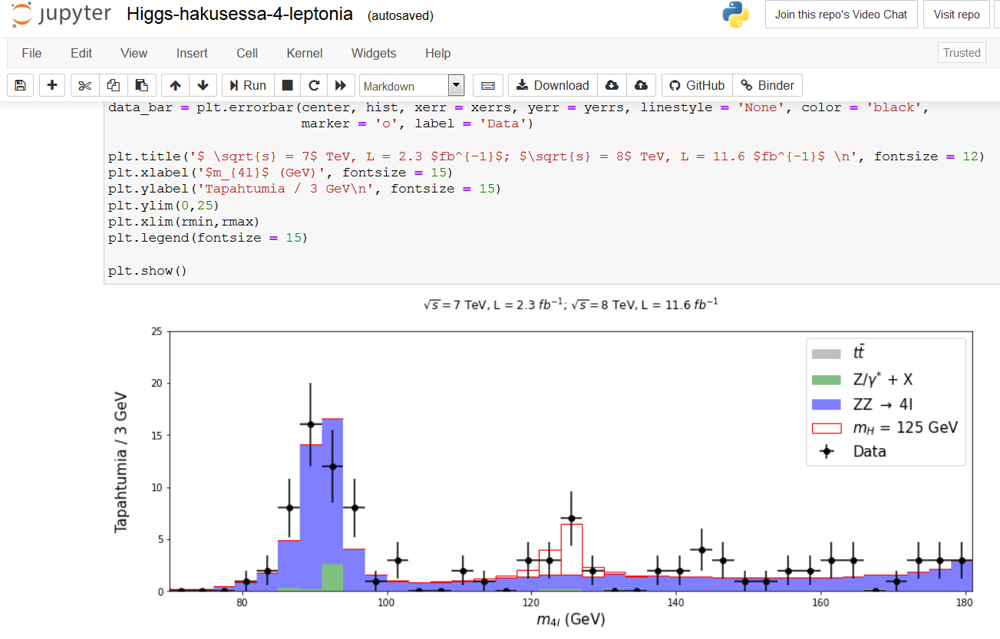

## Tervetuloa avoimen datan pariin!

Tältä sivulta löydät ohjeita ja lukiotason harjoitteita Python-kielellä ohjelmointiin avoimen datan parissa. Aihepiireihin mahtuu kaikenlaista hiukkasfysiikasta epidemiologiaan.

